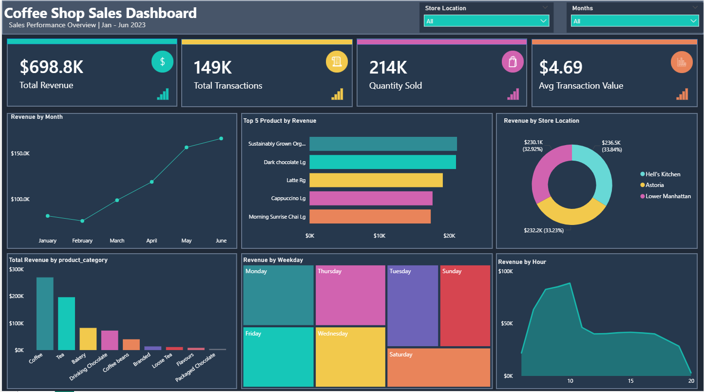

# Coffee Shop Sales Dashboard | Power BI

## Project Overview
This project is an interactive Power BI dashboard built to analyze coffee shop sales performance across key business areas, including revenue trends, product performance, store location, weekday sales patterns, and hourly revenue activity.

The dashboard was designed with a modern dark theme, custom KPI cards, slicers, and multiple visual types to create a clean and business-friendly reporting experience.

## Dashboard Preview

## Key Insights

- Coffee generated the highest revenue among product categories, while Tea also performed strongly with about $196.4K in revenue. This shows that beverage categories were the main revenue drivers.
- Sustainable Grown Organic Lg was the highest-revenue product, closely followed by Dark Chocolate Lg at about $21.0K.
- Hell’s Kitchen contributed the highest revenue among the three store locations.
- June recorded the highest monthly revenue at $166.5K, while February recorded the lowest revenue at $76.1K.
- Revenue increased from $76.1K in February to $166.5K in June, representing an approximate growth of 118.6%.
- The most noticeable monthly increase occurred between April and May, where revenue rose from $118.9K to $156.7K. This represents an increase of approximately $37.8K, or 31.8%.
- Weekday revenue was fairly balanced, with Monday, Friday, Thursday, and Wednesday all generating around $100K or more. Monday was the highest-performing day, but the difference between the top weekdays was small.
- The strongest sales activity occurred during the morning period, especially between 7 AM and 10 AM, with 10 AM showing the highest revenue point.
- Packaged Chocolate generated the lowest revenue among product categories, making it a potential area for review.

## Recommendations

- Prioritize inventory planning for Coffee and Tea products, as beverage categories are the strongest revenue drivers.
- Monitor high-performing products such as Sustainable Grown Organic Lg and Dark Chocolate Lg to ensure consistent stock availability.
- Use the 7 AM–10 AM morning peak period to support staffing, product availability, and faster service during busy hours.
- Review lower-performing categories such as Packaged Chocolate to decide whether they need promotion, repositioning, or reduced stock.
- Study the revenue growth from February to June to understand whether the increase was seasonal, promotional, or linked to changes in customer demand.
- Since weekday revenue is fairly balanced across several days, operational planning should remain consistent throughout the main working week rather than focusing only on one day.

## Tools Used
- Power BI Desktop
- Power Query
- DAX
- Data Modeling
- Data Visualization
- Dashboard Design

## Dashboard Features
- KPI cards for revenue, transactions, quantity sold, and average transaction value
- Revenue trend by month
- Top 5 products by revenue
- Revenue by store location
- Revenue by product category
- Revenue by weekday
- Revenue by hour
- Interactive slicers for month and store location

## Files Included
- `Coffee_Shop_Sales_Dashboard.pbix` — Power BI dashboard file
- `coffee_Shop_Dashboard.png` — dashboard preview image

## Author
Created by Oghenemarho Agunu
